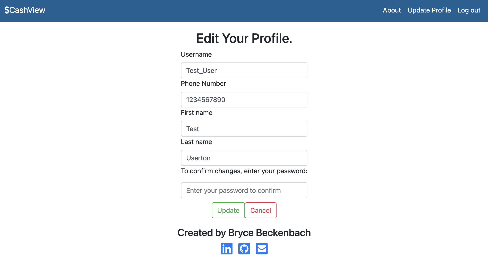
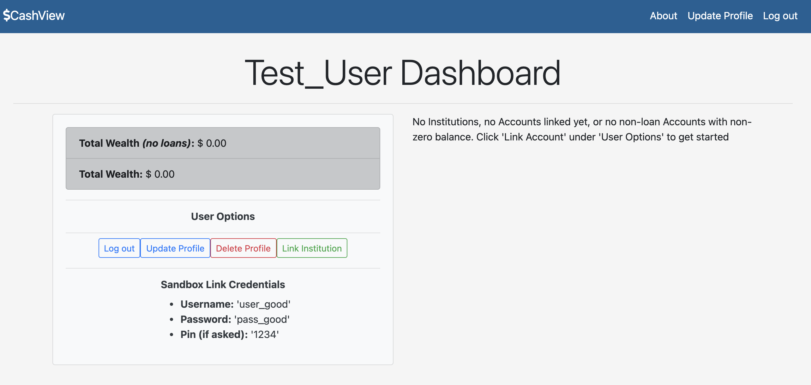
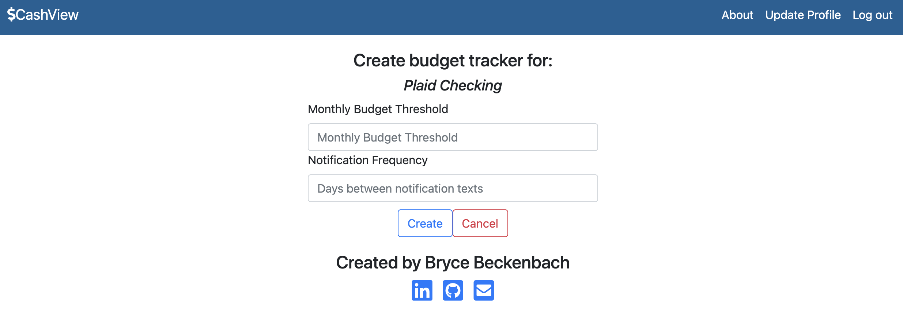
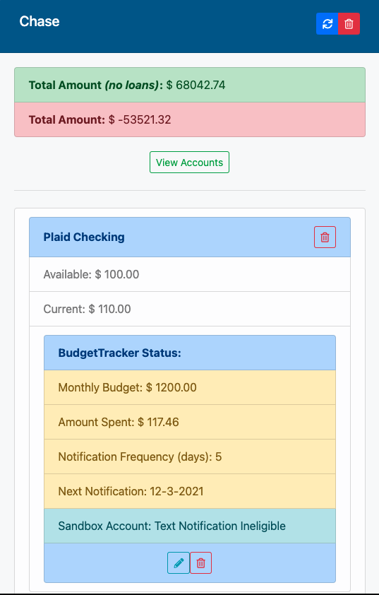
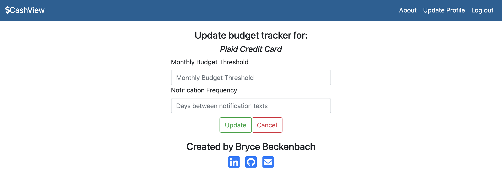
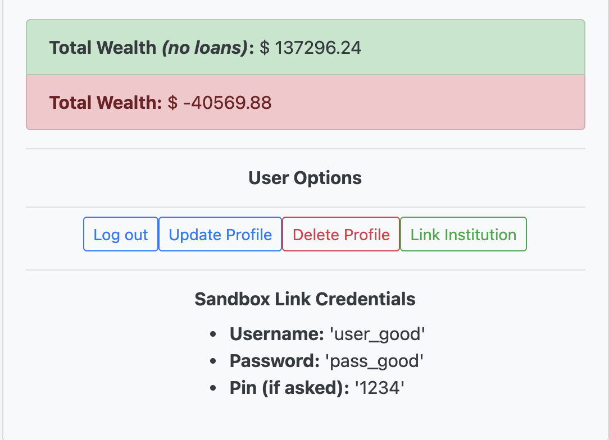

# CashView
## Pull in and view your financial data in one place!

[](https://wealth-and-budget.herokuapp.com/)


## Description:
This website acts as a personal finance dashboard. It allows users to make a profile and pull financial data from all of their financial institutions into one place. The app itself aggregates balances from all of the user's accounts, displaying their overall worth (with and without loans). It also uses graphics to illustrate the breakdown of the user's financial institutions and what percentage of their overall wealth is in each. Below the dashboard there is an account-level breakdown of each financial institution listed that displays the individual balances based on account type. This was completed in approximately 60 hours as part of Springboard Software Engineering Program.

## Table of Contents
1. [ Tech Stack ](#Tech-Stack)
    - [ Front-end ](#Front-end)
    - [ Back-end ](#Back-end)
    - [ Database ](#Database)
    - [ APIs Integrated ](#APIs)
2. [ Database Schema ](#Schema)
3. [ Deployment ](#Deployment)
4. [ Developer ](#Developer)
5. [ Features ](#Features)
    - [ User Features ](#UserFeatures)
        - [ Registration ](#Registration)
        - [ Login and Demo User ](#LoginAndDemo)
        - [ User Editing ](#EditUser)
        - [ User Deletion ](#DeleteUser)
    - [ Financial Institution and Account Features ](#FandAFeatures)
        - [ Adding a Financial Institution and Accounts ](#AddUFI)
        - [ Updating Financial Institution and Accounts ](#UpdateUFI)
        - [ Deleting Financial Institution and Accounts ](#DeleteUFI)
    - [ BudgetTracker Features ](#BTFeatures)
        - [ Adding a BudgetTracker](#AddBT)
        - [ Editing a BudgetTracker ](#EditBT)
        - [ Deleting a BudgetTracker ](#DeleteBT)
    - [ Dashboard Features ](#DashboardFeatures)
6. [ Running App Locally ](#RunningLocally)
    - [ Requirements ](#Requirements)
    - [ API Keys ](#APIKeys)
    - [ Import Project to your Local Machine ](#ImportProj)
    - [ Environmental Variables ](#.env)

<a name="Tech-Stack"></a>

## Tech Stack
<a name="Front-end"></a>

### Front-end
JavaScript, Axios, HTML5, CSS, Bootstrap, jQuery, GoogleChart.js

<a name="Back-end"></a>

### Back-end
Python, Flask, ORM: SQLAlchemy, Jinja2, WTForms, Bcrypt, Cron

<a name="Database"></a>

### Database
Postgres

<a name="APIs"></a>

### APIs integrated
- [ Plaid ](https://plaid.com/docs/api)
- [ Twilio ](https://www.twilio.com/docs)

<a name="Schema"></a>

## Schema


<a name="Deployment"></a>

## Deployment
CashView is deployed on heroku at [https://wealth-and-budget.herokuapp.com/](https://wealth-and-budget.herokuapp.com/)

<a name="Developer"></a>

## Developer
### Bryce Beckenbach


Please feel free to reach out!
- Email: [brycebeckenbach@gmail.com](mailto:brycebeckenbach@gmail.com)
- [ Linkedin ](https://www.linkedin.com/in/bryce-beckenbach-52a5276a/)

<a name="Features"></a>

## Features:

<a name="UserFeatures"></a>

### User Features

<a name="Registration"></a>

#### Registration
User Registration goes through the User model on the backend, user enters desired username, password, phone number, first name, last name, and desired account type (sandbox or development (more on that later)). All information is required and username must be unique for the model to generate a User instance. Password is run through Bcrypt hashing function where the output is stored in the database.


<a name="LoginAndDemo"></a>

#### Login and Demo User
Login authentication occurs on the User model as well. If a User logs in with correct username/password pair, User authenticate method returns the User instance, if not it returns False.

To reduce barrier of entry of someone trying to experience the App, I integrated a 'Demo User' button on the Login page. This uses JavaScript and jQuery behind the scenes to enter credentials:
- Username: Test_User
- Password: pass_good

**NOTE:** There is backend logic to protect Test-User from modification or deletion


<a name="EditUser"></a>

#### User Editing
Once a user is logged in, they will see 'Update Profile' as an option on their navbar and under 'User Options' on the dashboard, there is an 'Update Profile' button a user can click which will lead them to a portal to edit their profile. All of their current information is populated into the input fields of the form. Once they have updated their information to the desired values and enter their password at the bottom to confirm the changes, they can click 'Update' to have their changes made in the database.



<a name="DeleteUser"></a>

#### User Deletion
Once a user is logged in, they will see an option to 'Delete Profile' under 'User Options'. Once they click this, their User instance will be removed from the database on the back-end and they will be redirected to the welcome page of CashView on the frontend. There is a cascading deletion set up in the database schema so all FinancialInstitutions, Accounts, and BudgetTrackers will be deleted as well.

<a name="FandAFeatures"></a>

### Financial Institution and Account Features

<a name="AddUFI"></a>

#### Adding a Financial Institution and Accounts
Using the Plaid API, a user can securely add their credentials to Plaid's Link interface that is embedded in the dashboard. **These credentials are not stored in the any area of CashView at any point**. To avoid this being an issue, I made sure users that sign up have the option of having a **development** account, which deals with real bank data, or a **sandbox** account, which deals with dummy bank accounts from Plaid. The Demo user experience is a **sandbox** account as well. 

Once on the dashboard page, a user clicks on 'Link Institution' under 'User Options'.



After the user does this, Plaid's Link interface experience will appear. You will be able to choose your financial institution of choice from a list, then enter the required credentials to pull the data into CashView. If you have a **development** account, you enter your real credentials, if you have a **sandbox** account you enter the information under 'User Options' in the image above (can also be seen at the footer of the Link portal):
- Username: user_good 
- Password: pass_good


If the correct information is entered, CashView will go through the [ Plaid Token exchange process ](https://plaid.com/docs/link/) and receive an **access_token** associated with the specified financial institution. Using this access_token, the app makes two further API calls to Plaid:
1. To retrieve data on the financial institution (called an 'item' in Plaid's vernacular) [see Response Fields](https://plaid.com/docs/api/institutions/#institutionsget_by_id)
2. To retrieve data on accounts held by that financial institution [see Response Fields](https://plaid.com/docs/api/products/#accountsbalanceget)

Financial Institution and Account/s instances are created in the CashView database then json data is sent to the dashboard to create the required HTML to represent the instances. If a user already has Financial Institutions and Accounts associated with their User instance, Jinja2 templates create the required HTML upon page load.

*(Financial Institution in CashView Dashboard)*


*(Same Financial Institution in CashView Dashboard with some Accounts deleted and view uncollapsed)*


**NOTE:** Due to the fact I am using the free tier of Plaid's API, API calls for Account retrieval take upwards of 30 seconds. Because this is deployed on Heroku and their dynos timeout after a 30 second wait **the developer User account type will not allow you to connect your actual accounts on the heroku deployment of CashView**. However, it does work on local deployment, even though you have to wait ~40 seconds (what I benchmarked). I checked with Plaid's support team and they confirmed that the free tier of their API service would likely have longer wait times while the premium tier would see 2-3 second waits.

*(Confirmation of long API wait times for free tier of service)*


<a name="UpdateUFI"></a>

#### Updating Financial Institution and Accounts
For each Financial Institution on the dashboard, there is an 'Update' icon. This is for manual refreshing of account balances. This will make a call to the back-end to grab all the Plaid account IDs associated with that Financial Institution in the CashView database and get the most up-to-date balance information for these accounts from Plaid. This data will be sent back to the front-end and the HTML will be updated to reflect the most recent balances.

*(Top right blue refresh icon)*


<a name="DeleteUFI"></a>

#### Deleting Financial Institution and Accounts
For each Financial Institution and account (uncollapsed) on the dashboard, there is a 'Delete' icon. This is for deletion of desired Accounts you do not want to track and Financial Institutions, respectively. This will make a call to the back-end to delete the desired account or Financial Institution in the CashView database. Upon deletion, your overall wealth and balance information at the Financial Institution level will change (if you delete accounts from a Financial Institution). Updated roll-up balance data will be sent back to the front-end and the HTML will be updated to reflect the most recent balances.

*(Financial Institution deletion: Top right of 'Chase', red deletion button icon)*


*(Account deletion: Top right of 'Plaid Checking' red deletion button icon)*


<a name="BTFeatures"></a>

### BudgetTracker Features
<a name="AddBT"></a>

#### Adding a BudgetTracker
If an Account is elegible (is of type 'credit' or sub-type 'checking'), it will have a 'Create BudgetTracker' button displayed at the bottom. Clicking this will bring the user to a BudgetTracker creation form for that particular Account where they can enter their desired 'Monthly Budget Threshold' amount (must be greater than $0) and their desired Notification Frequency that they would like to receive text notifications at (must be between 1 and 15 days). These texts updates will occur at frequency multiples of the day frequency they enter (e.g. if they enter 2, they would receive a text notification every other day). This is enabled by a script that runs once each day to:
- Update the most recent amount spent on the BudgetTracker
- See if the notification date on the budget tracker is equal to the date that day
    -If it is not, it does nothing
    -If it **is**, it fires off a text notification with the amount spent compared to the budget threshold and updates the next notification date using the desired notification frequency



The BudgetTracker will then appear on the Dashboard under the associated Account displaying all information (Budget Threshold, Amount Spent, Notification Frequency, Next Notification Date) which is updated by the script that runs daily.

**NOTE:** If the User's account_type is 'sandbox', they are ineligible for text notifications. I am also running the freemium of Twilio, so for the 'development' User account_type, unless your cellphone number is verified under my Twilio account for the web app, you would not receive a text message. If you would like to use the text notification feature, you would need to get your own API keys for Plaid and Twilio and run this app locally.



<a name="EditBT"></a>

#### Editing a BudgetTracker
Once a BudgetTracker is created, it will appear on the Dashboard where it can be edited or deleted. To edit, click the 'edit' icon at the bottom of the BudgetTracker. This will direct the User to the Update BudgetTracker form where the user can modify their Budget Threshold and/or their Notification Frequency. These values will be updated in the database and the new values will be reflected on the Dashboard.

*(BudgetTracker Update: Bottom of BudgetTracker blue 'edit' icon)*


*(BudgetTracker Update Form)*


<a name="DeleteBT"></a>

#### Deleting a BudgetTracker
To delete a BudgetTracker, navigate to the associated Account on the Dashboard where it lives. At the bottom of the BudgetTracker Card, click on the 'delete' icon. The BudgetTracker will be removed from the database and the HTML will return the 'Create BudgetTracker' button under the Account.

*(BudgetTracker Delete: Bottom of BudgetTracker red 'delete' icon)*


*(BudgetTracker Create Button returned)*


<a name="DashboardFeatures"></a>

### Dashboard Features
The dashboard is designed to be a quick view of the aggregate of all of a User's financial institutions. The total holdings, both with and without loans are displayed in the top left of the dashboard. The User Model has a method that runs through all of the User instance's Financial Institutions, summing their dollar totals, with a boolean input to signify whether or not to return the sum with loans included (loans are subtracted from the total as they are a dollar amount owed). Financial Institutions have a similar method that allows them to run through all of their Accounts and provide a dollar sum with or without loans. Both of these values are displayed and color coded (green signifies a positive balance, grey means a $0 balance, red is a negative balance).



To the right of the dollar view in the dahsboard is a pie chart that shows a percentage breakdown of how Financial Institution sums (without loans) represent a User's total wealth. This utilizes Google Charts.


<a name="RunningLocally"></a>

### Running App Locally

<a name="Requirements"></a>

#### Requirements
    - Python
    - PostgresSQL
    - pip 

<a name="API Keys"></a>

#### API Keys
Retrieve free API keys from:
- [ Plaid ](https://plaid.com/docs/api)
- [ Twilio ](https://www.twilio.com/docs)

<a name="ImportProj"></a>

#### Import Project to your Local Machine
1. Clone the repository:
    - `git clone https://github.com/bbeckenb/Wealth_and_Budget_App.git`
2. Change Directory to the project:
    - `cd Wealth_and_Budget_App`
3. Create and Activate Python Virtual Environment:
    - `python3 -m venv venv`
    - `source venv/bin/activate`
4. Install requirements:
    - `pip install -r requirements.txt`
5. Set up local database:
    - `createdb wealth_and_budget_db`
6. Set up .env file:
    - `touch .env`
7. Add the following fields and enter your information where it says **YOUR_INFO** 
    ```PLAID_CLIENT_ID=YOUR_INFO
    PLAID_SECRET=YOUR_INFO
    PLAID_PRODUCTS=auth,transactions
    PLAID_COUNTRY_CODES=US,CA
    TWILIO_ACCOUNT_SID=YOUR_INFO
    TWILIO_AUTH_TOKEN=YOUR_INFO
    TWILIO_NUM=YOUR_INFO
    SECRET_KEY=YOUR_INFO
    ```
8. Job Scheduling:
    - Script `scheduled_jobs.py` is scheduled to run on Heroku
    - If you choose to run this locally, include following code in main `app.py` and follow directions below:
        - **Dependencies to import:**
            ```
            from flask_crontab import Crontab
            from CronJobs.UFI_jobs import scheduled_daily_refresh_all_accounts
            from CronJobs.BudgetTracker_jobs import scheduled_budget_tracker_jobs
            ```
        - **Initializations:**
            `crontab = Crontab(app)`
        - **CRON schedule function definition:**
            ```
            @crontab.job(minute=0, hour=12)
                def scheduled_jobs():
                    scheduled_daily_refresh_all_accounts(plaid_inst)
                    scheduled_budget_tracker_jobs(plaid_inst, twilio_inst)
            ```
        - **Command Line directions:**
            - CRON Scheduled Jobs For local server
            - **This will run a job everyday at 12pm UTC:** run `flask crontab add` in command line to initialize 
            - **This will delete the CRON job:** run `flask crontab remove` in command line to remove
            - **These are additional command line commands to navigate jobs**
                - `crontab -l` to see list of jobs
                - `crontab -e` to manually edit list of jobs, 'esc' :wq 'enter' to leave list

            